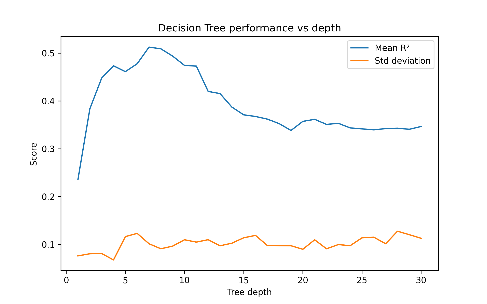
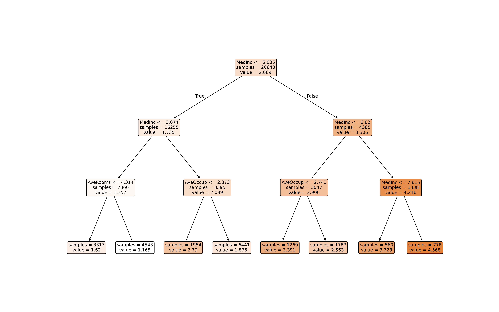
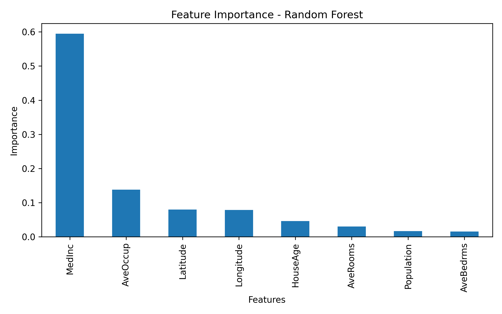

# Tree Models Analysis

## 1. Overview
This document analyzes the behavior of tree-based regression models on the California Housing dataset.

The goal of this analysis is to understand how Decision Trees and Random Forest models behave, how model complexity affects performance, and how these models compare with the linear models implemented in the previous project.

Experiments in this report focus on:

- Understanding the behavior of decision trees
- Studying the effect of tree depth on model performance
- Visualizing tree structures
- Comparing single trees with Random Forest ensembles
- Identifying important features driving model predictions

All evaluations are performed using cross-validation in order to estimate generalization performance.

---

## 2. Baseline Results
Before conducting further experiments, baseline performance was measured using a Decision Tree with limited depth and a Random Forest model trained on the same feature set used in the previous linear model project.

### 2.1 Decision Tree (depth = 5)

R²: 0.4999  
MAE: 0.6039  
RMSE: 0.8160  

### 2.2 Random Forest

R²: 0.6669  
MAE: 0.4788  
RMSE: 0.6660  

### 2.3 Initial Observations

The Decision Tree achieves moderate predictive performance but remains less accurate than the Random Forest model.

Random Forest significantly improves performance by combining predictions from many trees, reducing variance and producing more stable results.

Compared with the previous linear models (R² ≈ 0.57–0.61), the Random Forest model achieves stronger performance, suggesting that tree-based methods capture non-linear relationships and feature interactions that linear models cannot represent.

Further experiments will analyze how tree complexity affects model behavior and investigate the internal structure of the learned trees.

---

## 3. Decision Tree Experiments

### 3.1 Decision Tree Depth vs Performance

To study how model complexity affects performance, the maximum depth of the Decision Tree was varied from 1 to 30.  
Each configuration was evaluated using 5-fold cross-validation, recording the mean R² score and the standard deviation across folds.

#### Observations

The results show a clear relationship between tree depth and model performance.

For very shallow trees (depth 1–3), performance is relatively low. This indicates **underfitting**, as the model is too simple to capture the relationships in the dataset.

As the tree depth increases, the mean R² score improves significantly, reaching its highest values around **depth 6–8**. In this range, the model has enough flexibility to capture useful patterns in the data without excessively fitting noise.

Beyond this point, performance gradually declines as depth increases further. Deeper trees introduce many additional splits, which can cause the model to learn highly specific patterns from the training folds that do not generalize well to unseen data. This behavior is consistent with **overfitting**.

The standard deviation across cross-validation folds also remains relatively stable but tends to increase slightly for deeper trees, suggesting greater sensitivity to the specific training subset used in each fold.

#### Interpretation

This experiment illustrates the classical **bias–variance tradeoff**:

- **Low depth** → high bias, underfitting  
- **Moderate depth** → best balance between bias and variance  
- **High depth** → increased variance and overfitting  

The optimal region for this dataset appears to be around **depth 6–8**, which aligns with the earlier baseline experiment where a depth-5 tree produced reasonable but not optimal results.

These findings confirm that controlling tree complexity is critical when using single decision trees, as unrestricted trees can easily grow large and memorize training data rather than learning generalizable patterns.

### 3.2 Decision Tree Visualization

To better understand how the model makes predictions, a shallow decision tree with `max_depth = 3` was trained and visualized. Limiting the depth allows the learned rules to remain interpretable.

#### Root Split

The root node splits on **MedInc (median income)**:

MedInc ≤ 5.035

This indicates that median income is the **most important variable** for predicting house prices in the dataset. The tree first separates districts with lower income levels from those with higher income levels.

Districts with higher median income are predicted to have significantly higher house values, which aligns with economic intuition.

#### Lower Income Branch

For districts with `MedInc ≤ 5.035`, the tree further splits on:

MedInc ≤ 3.074

This creates a separation between **very low income areas** and **moderate income areas**.

For the lowest income group, the model then considers **AveRooms (average number of rooms per household)**:

AveRooms ≤ 4.314

Districts with fewer rooms tend to have lower predicted house prices.

For the moderate income group, the tree instead splits on **AveOccup (average household occupancy)**:

AveOccup ≤ 2.373

Higher household occupancy may indicate denser living conditions, which tends to correlate with lower housing prices.

#### Higher Income Branch

For districts with `MedInc > 5.035`, the tree again uses income to refine predictions:

MedInc ≤ 6.82

This suggests that income continues to be the strongest predictor even among higher income areas.

In this region, the tree also considers **AveOccup**, separating districts based on population density characteristics.

Finally, for the highest income districts (`MedInc > 6.82`), another income-based split appears:

MedInc ≤ 7.815

This branch leads to the highest predicted house values in the dataset.

#### Interpretation

Several important patterns emerge from this visualization:

- **Median income dominates the decision process**, appearing at multiple levels of the tree.
- Secondary features such as **average rooms and household occupancy** help refine predictions within income groups.
- The tree essentially segments the dataset into different **socioeconomic tiers**, using income as the primary signal and housing characteristics as secondary refinements.

This confirms that income is the most influential variable in the California Housing dataset, while other features contribute additional contextual information.

The visualization also illustrates why decision trees are considered **interpretable models**: the prediction process can be expressed as a sequence of simple, human-readable rules.

---

## 4. Random Forest Analysis

### 4.1 Random Forest Feature Importance

To better understand which variables contribute most to the predictions, feature importance scores were extracted from the trained Random Forest model. These scores measure how much each feature contributes to reducing prediction error across all trees in the ensemble.

#### Observations

The results show that **median income (`MedInc`) overwhelmingly dominates the prediction process**, accounting for roughly 60% of the model's total importance. This confirms the pattern already observed in the decision tree visualization, where `MedInc` appeared at the root and at multiple levels of the tree.

The second most influential feature is **average household occupancy (`AveOccup`)**, suggesting that population density characteristics provide additional information about housing prices.

Geographic variables — **latitude and longitude** — also play a meaningful role in the model. This indicates that location-based patterns contribute to price differences across districts, which is expected in real estate data.

Other features such as **house age, average number of rooms, population, and average number of bedrooms** have smaller contributions but still provide incremental predictive signal.

#### Interpretation

Overall, the feature importance distribution confirms that **income level is the primary driver of housing value in the dataset**, while demographic and geographic characteristics refine predictions within income groups.

Compared to the shallow decision tree visualization, the Random Forest is able to incorporate a broader range of features, since different trees in the ensemble explore different splits. This allows the model to capture more complex patterns in the data while maintaining stable predictions.

### 4.2 Comparison with Decision Trees

Comparing the Random Forest model with the single Decision Tree highlights several important differences in how the two models learn from the data.

The shallow decision tree visualization showed that **median income (`MedInc`) dominates the decision process**, appearing at the root node and again in deeper splits. The tree relies on a small number of features to partition the dataset into income-based segments, with variables such as `AveRooms` and `AveOccup` used to refine predictions within those groups.

The Random Forest analysis confirms this pattern but reveals a broader view of the dataset. While **`MedInc` remains by far the most important feature**, the forest assigns meaningful importance to additional variables such as **`AveOccup`, latitude, and longitude**. Because the forest consists of many trees trained on different bootstrap samples and feature subsets, it is able to explore a wider range of splits than a single tree.

This difference also explains the performance gap observed earlier. A single decision tree is highly sensitive to the specific splits it chooses, which can lead to unstable predictions and higher variance. Random Forest reduces this variance by **averaging predictions across many trees**, producing a more robust model that generalizes better to unseen data.

Overall, the comparison shows that while decision trees are highly interpretable and useful for understanding the structure of the data, ensemble methods such as Random Forest can leverage the same underlying rules more effectively to produce stronger predictive performance.

---

## 5. Discussion

The experiments conducted in this analysis highlight how tree-based models behave as model complexity increases and how ensemble methods improve stability.

The decision tree depth experiment clearly demonstrated the tradeoff between underfitting and overfitting. Very shallow trees were unable to capture meaningful structure in the data, while deeper trees began to memorize patterns specific to the training folds. This resulted in declining cross-validation performance beyond moderate tree depths.

Visualizing a shallow decision tree helped reveal how the model structures its decisions. The tree first separates districts based on **median income**, then refines predictions using housing characteristics such as average rooms and household occupancy. This confirms that the model is primarily segmenting the dataset into socioeconomic tiers.

The Random Forest model extends this idea by combining many such trees. Instead of relying on a single set of splits, the forest aggregates predictions from multiple trees trained on different subsets of the data. This significantly reduces model variance and leads to more stable predictions.

Feature importance analysis further confirmed that **median income is the dominant predictor**, while geographic and demographic variables contribute additional signal.

Overall, the experiments show that tree models can capture meaningful non-linear patterns in the dataset, and that ensemble methods provide a powerful way to improve predictive performance.

---

## 6. Key Takeaways

- **Median income is the strongest predictor of housing prices** in the California Housing dataset.
- Decision trees can capture meaningful structure in the data but are highly sensitive to model complexity.
- Increasing tree depth initially improves performance but eventually leads to overfitting.
- Random Forest significantly improves predictive performance by averaging predictions across many trees.
- Ensemble models can utilize a wider set of features and produce more stable predictions than a single tree.

---

## 7. Next Steps

Further work on this project could focus on exploring additional aspects of tree-based models and improving model performance:

- Investigate additional **tree hyperparameters** such as `min_samples_leaf`, `min_samples_split`, and `max_features`.
- Compare Random Forest performance across different values of **`n_estimators`**.
- Analyze **residual errors** to better understand where the model struggles.
- Explore **feature engineering**, particularly household and population ratios, to determine whether additional derived features improve tree-based models.
- Compare tree-based models with more advanced ensemble methods such as **Gradient Boosting** in future experiments.